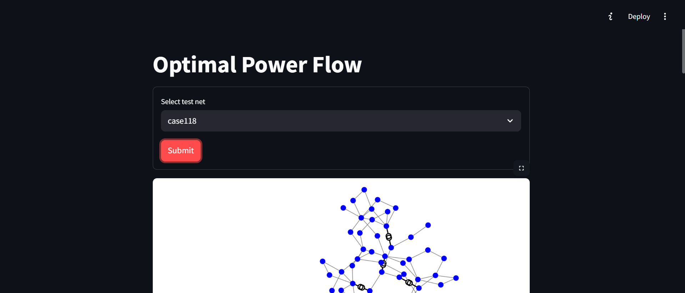

# 🔌 GNN-Based Optimal Power Flow (OPF) Solver

A deep learning framework for solving the Optimal Power Flow (OPF) problem using Graph Neural Networks (GNNs). This project leverages power system physics, graph structures, and modern GNN architectures to predict optimal power flow solutions with high accuracy and generalizability.

## 🧠 Overview
This project integrates:

- PyTorch Geometric for GNN modeling
- pandapower for electrical network simulation
- Custom GCN hybrid architecture
- Complex power system constraints, including:
    - Generator cost minimization
    - Transformer limits
    - Voltage magnitude bounds
    - Y-bus matrix-based modeling


## ⚙️ Features
- Graph-based Representation: Converts power systems into node-edge graph format.
- Physics-aware Training: Loss function incorporates power flow equations and cost constraints.

## 📈 Model
- Node Features: Voltage, voltage limits, power demand, generation limits
- Edge Features: Line impedance, transformer status, max current through lines
- Target: Optimal voltages, and phase angles of each bus 

## 🚀 Getting Started
### 1. Install Dependencies
```bash
pip install -r requirements.txt
```

 Key Libraries:

- torch
- torch-geometric
- pandapower

### 2. Run the streamlit app
```bash
streamlit run ui/app.py
```

## 📊 Evaluation
- MSE on generator outputs
- Constraint violation penalties
- Generalization to unseen topologies
